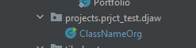

# The DungeonJaw INFO
[Link to russian version](https://github.com/Maxuss/djaw/blob/main/ru_doc.md)

DungeonJaw or DJaw is Game Engine based on Java.

## What are the best parts of DJaw?
1. DJaw is completely open-source!
2. DJaw has a documentation on making your own projects!
3. DJaw is super easy-to-understand!
4. DJaw uses its own file extensions for data - `*.dji`!
5. DJaw has more than one *compiler* to use!

# Documentation on working with DungeonJaw and creating projects with it

## Formatting a project

### Main formatting
First off, find your `projects` folder.

Create a `data.dji` file there first.
#### Creating Data DJI

~~You will be able to create configs in future updates straight in the GUI~~
DONE

You need only one JSON-like file to create.

Go to `projects/<projectname>/` and create file `data.dji`

What does `.dji` mean? **DJ**aw **I**nformation of course!

File requires JSON syntax!
This is just an example:

```json
{
  "_comment": "these comments wont parse",

  "normalSignature": "undefined_unstable",
  "dunjerCache": false,
  "djawCache": false,
  "devjawCache": false,
  "standardCompiler": "djaw",
  "mainClass": "DJWExample",
  "exceptionClass": "DJWExampleExceptions",
  "modifyInnerCode": false,

  "package": "com.ex.djaw",

  "projectID": "djaw-example",
  "projectName": "Example DJaw Project",
  "projectDescription": "Example Project!",
  "projectAuthor": "Maksim 'Maxuss' Petrov",
  "projectCredits": "My friends!",
  "projectVersion": "1.31.531 Stable",
  "projectLanguage": "en-US",
  "projectWebsite": "example.com"

}
```
#### Explanations and meanings
```json
"normalSignature"
``` 
Signature compiler leaves in log when parsing your file.
```json
"standardCompiler"
```
Is main compiler. Only change if you are using another compiler.
```json
{
  "dunjerCache": false,
  "djawCache": false,
  "devjawCache": false
}
```
Are all needed for saving some data locally. Not used right now.

```json
"package"
``` 
is your main package.

```json
"mainClass"
```
and
```json
"exceptionClass"
``` 
are needed for the engine to see your classes and creating them.
```json
"modifyInnerCode"
```
Going to be used in future releases
```json
"package"
```
Package for your project to be generated.

Everything else that starts with `project` is just data that shows up

### Creating a package and class
Then, create a new package there, it should look something like that:
```
djaw
  |- djaw.jar
  |- djaw
  |     |- projects
        |         |- example-id
                  |         |- data.dji
                            |- com.project.djaw
                            |- everything else
                            |
```                                 

Note, that package **HAS TO** end with .djaw. That's the _DJDAS_ standard.

Then you should create your main class.

It should look like that:

*ignore the yellow highlight*

You can also use pre-built simple project generator.

You should use `DJLib.jar` as external library for creating DJaw projects. Example:

```java
import com.maxus.djaw.*;
import static com.maxus.djaw.DJaw.DJawLogger;
```
You'll figure out I guess.

## Using and compiling a project

Let's say you have made a project.

You should download DJDK.zip and unzip files in some directory.

What does DJDK Stand for? *DJ*aw *D*eveloping *K*it!

Locate to `src/com/maxus/djaw/projects` and paste whole project folder there.

Should look like this:


And now just modify the `DJaw.java` to import your DJaw Project and to use your features.

Now you can compile and run it!

## DJaw Development API Standards

_DJDAS_ Or *DJ*aw *D*evelopment *A*PI *S*tandards

_DJDAS_ are Standards in developing using DJaw.

_DJDAS_ aren't necessary, but code looks better with them


### Current version: **DJDAS 258**
1. Project ids HAVE to use `_` instead of ` `.
2. Project packages should end with `.djaw`. E.G., `org.example.djaw`.
3. It's better to use DJaw Exceptions class when possible, instead of normal Java exceptions
4. It's better to create `.signature` file in your project package. Expected contents:
```json
{
  "commonLicence": "GNU General v3.0",
  "compatibility": "1.0.0.0",
  "projectMeta": "djaw-project-common",
  "projectSignature": "your-custom-project-signature"
}
```
5. Follow Java Standards: `JEP`
6. Report all the errors you can witness

# To Be Continued

DJaw is still not fully developed, and I have big plans for it.

Some of the plans:
1. Actual game engine
2. Better GUI
3. More functionality
4. Easier project creating
5. More stability
