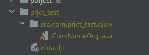
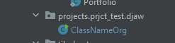

# Информация о DungeonJaw
[English version link](https://github.com/maxuss/djaw/blob/main/README.md)

DungeonJaw или Djaw - это игровой движок на основе Java.

## Каковы лучшие части Djaw?
1. Djaw совершенно открытый источник!
2. У Djaw есть документация по созданию ваших собственных проектов!
3. Djaw - супер легко понять!
4. DJAW использует свои собственные расширения файлов для данных - `* .dji`
5. Djaw имеет более одного * компилятора * для использования!

# Документация по работе с DungeonJaw и создание проектов с ним

## Форматирование проекта

### Основное форматирование
Во-первых, найдите папку «Проекты».
Создайте файл «Data.dji» сначала.
#### Создание данных dji

~~Вы сможете создать конфиги в будущих обновлениях прямо в GUI~~
ГОТОВО

Вам нужен только один файл JSON - подобный для создания.
Перейдите к `Проекты/<projectname>/` и создайте файл `data.dji`

Что значит `.dji`? **DJ**AW **I**nformation конечно!

Файл требует синтаксиса JSON!

Это только пример:

```json
{
  "_comment": "these comments wont parse",

  "normalSignature": "undefined_unstable",
  "dunjerCache": false,
  "djawCache": false,
  "devjawCache": false,
  "standardCompiler": "djaw",
  "mainClass": "DJWExample",
  "exceptionClass": "DJWExampleExceptions",
  "modifyInnerCode": false,

  "package": "com.ex.djaw",

  "projectID": "djaw-example",
  "projectName": "Example DJaw Project",
  "projectDescription": "Example Project!",
  "projectAuthor": "Maksim 'Maxuss' Petrov",
  "projectCredits": "My friends!",
  "projectVersion": "1.31.531 Stable",
  "projectLanguage": "en-US",
  "projectWebsite": "example.com"

}
```

#### Объяснения и значения
```json
"normalSignature"
``` 
Подпись компилятора в журнале при расстановке вашего файла.
```json
"standardCompiler"
```
Является главным компилятором.  Изменить только, если вы используете другой компилятор.
```json
{
  "dunjerCache": false,
  "djawCache": false,
  "devjawCache": false
}
```
Все необходимы для сохранения некоторых данных локально.  Не используется прямо сейчас.

```json
"package"
``` 
Ваш главный пакет.

```json
"mainClass"
```
и
```json
"exceptionClass"
``` 
Необходимы для двигателя, чтобы увидеть ваши классы и создавать их.
```json
"modifyInnerCode"
```
Собирается использоваться в будущих выпусках
```json
"package"
```
Пакет для вашего проекта, который будет сгенерирован.

Все остальное, что начинается с `project` - это просто данные, которые отображаются

### Создание пакета и класса
Затем создайте новый пакет там, он должен выглядеть что-то подобное:
```
djaw
| - djaw.jar.
| - Djaw.
|   | - Проекты
|.  | - пример-идентификатор
|.  | - data.dji.
| - com.project.djaw.
| - все остальное
|.
```

Примечание, этот пакет **должен** заканчиваться `.djaw`.  Это стандарт _djdas_.
Затем вы должны создать свой главный класс.

Это должно выглядеть так:



*Игнорируйте желтую подсветку*

Вы также можете использовать предварительно построенный простой генератор проекта.

Вы должны использовать `DJLib.jar` в качестве внешней библиотеки для создания проектов DJAW.  Пример:
  ```java
  import com.maxus.djaw. *;
  import static com.maxus.djaw.djaw.djawlogger;
  ```
  Вы понимаете, я думаю.

## Использование и компиляция проекта

Допустим, вы сделали проект.

Вы должны загрузить DJDK.zip и распаковать файлы в какой-то каталог.

Что значит DJDK?  *DJ*aw *D*evelopment *k*it!

идите в `src/com/maxus/djaw/projects` и вставьте всю папку проекта сюда.

Должно выглядеть так:


И теперь просто измените «DJaw.java», чтобы импортировать свой проект DJAW и использовать ваши функции.

Теперь вы можете компилировать и запустить его!

## Стандарты API разработки DJAW
_Djdas_ или *DJ*aw *D*evelopment *A*PI *S*tandards

_Djdas_ - это стандарты в разработке с использованием Djaw.

_Djdas_ не нужен, но код выглядит лучше с ними


### Текущая версия: **DJDAS 258**
1. Идентификаторы проекта должны использовать `_` вместо пробела.
2. Пакеты проекта должны заканчиваться на `.djaw`. Например, `org.example.djaw`.
3. Лучше использовать класс ошибок DJAW, а не обычные ошибки Java
4. Лучше создать файл `.signature` в вашем пакете проекта.  Ожидаемое содержимое:
```json
{
  "commonLicence": "GNU General v3.0",
  "compatibility": "1.0.0.0",
  "projectMeta": "djaw-project-common",
  "projectSignature": "your-custom-project-signature"
}
```
5. Следуйте стандартам Java: `JEP`
6. Сообщите обо всех ошибках, которые вы можете увидеть

# Продолжение следует

Djaw до сих пор не полностью развит, и у меня есть большие планы на это.

Некоторые из планов:
1. Фактический игровой двигатель
2. Лучший графический интерфейс
3. Больше функциональности
4. Простые создание проекта
5. Больше устойчивости